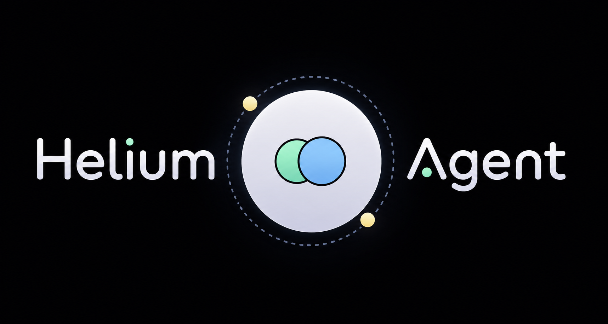

# Helium Agent

Helium is a local-first AI assistant with a voice pipeline, tool-calling agent loop, structured memory, and an optional web chat UI. It is designed for macOS and Apple Silicon, with local STT through MLX Whisper, wake-word detection through OpenWakeWord, TTS through Kokoro, and an LLM brain served from your own llama.cpp or Ollama-compatible local stack.

## What It Can Do

- **Voice interaction:** Say **"Helium"** to wake the assistant, or press **Enter** for push-to-talk.
- **Wake diagnostics:** Tune threshold, smoothing, cooldown, calibration, wake scores, and input levels from local settings.
- **Local speech-to-text:** Transcribes microphone input with `mlx-whisper`, including retry and audio-capture diagnostics.
- **LLM orchestration:** Maintains conversation history and runs a tool-feedback loop around local model responses.
- **Text-to-speech:** Speaks responses through Kokoro voice synthesis.
- **Tool calling:** Searches the web, creates files, stores memories, opens apps, and reports the current time.
- **Tool permissions:** Risky actions, such as file creation and app opening, can require confirmation.
- **Follow-up mode:** Keeps listening briefly after a reply so you can continue without repeating the wake word.
- **Web UI:** Includes a FastAPI WebSocket backend and a React/Vite frontend for browser-based chat.
- **Terminal UX:** Uses `rich` for readable console output and macOS `afplay` cues for wake/sleep sounds.

## Project Structure

```text
Helium/
├── main.py                 # Voice assistant entry point
├── assistant.py            # Assistant-facing orchestration helpers
├── requirements.txt        # Python dependencies
├── docker-compose.yml      # API + frontend containers
├── Dockerfile.api          # FastAPI backend image
├── Dockerfile.frontend     # React frontend image
├── api/
│   └── main.py             # FastAPI WebSocket chat API
├── config/
│   ├── settings.py         # Typed defaults and settings loader
│   └── settings.toml       # Local service, wake, speech, and assistant settings
├── core/
│   ├── llm.py              # LLM response generation and tool loop
│   └── orchestrator.py     # Assistant orchestration layer
├── engine/
│   ├── stt.py              # Speech-to-text handling
│   ├── tts.py              # Text-to-speech handling
│   └── wake_word.py        # Wake-word detection
├── frontend/
│   ├── src/                # React chat interface
│   ├── nginx/              # Static app server config
│   └── package.json        # Vite scripts and frontend dependencies
├── memory/
│   └── graph.py            # Local memory graph support
├── tools/
│   ├── registry.py         # Tool definitions and prompt context
│   ├── file_ops.py         # File creation tool
│   ├── memory_ops.py       # Memory tools
│   ├── system_ops.py       # System tools
│   ├── web_search.py       # Web-search tool entry point
│   └── search/             # Search providers, planning, ranking, fetching, extraction
├── utils/
│   ├── audio.py            # macOS sound cues
│   ├── health.py           # Service health checks
│   ├── history.py          # Command/conversation history helpers
│   └── parser.py           # Robust JSON/tool-call parsing
└── tests/                  # Unit tests for parser, tools, search, memory, and wake word logic
```

## Prerequisites

Helium is optimized for **macOS on Apple Silicon** because the voice pipeline uses `mlx-whisper` and macOS audio cues. Some server-only pieces can run in containers, but microphone capture and local audio playback are best run directly on macOS.

You will need:

- Python 3.11+
- A working microphone with terminal/app permission
- PortAudio dependencies for `pyaudio` and `sounddevice`
- A local LLM service, usually `llama.cpp`
- Optional local SearxNG for local-first web search
- Node/Bun only if you are developing the frontend outside Docker

Default service URLs are configured in [`config/settings.py`](config/settings.py) and can be overridden in [`config/settings.toml`](config/settings.toml).

## Installation

1. Clone the repository:

   ```bash
   git clone <repository-url>
   cd Helium
   ```

2. Create and activate a virtual environment:

   ```bash
   python -m venv .venv
   source .venv/bin/activate
   ```

3. Install Python dependencies:

   ```bash
   pip install -r requirements.txt
   ```

If audio dependencies fail to build, install PortAudio first, then rerun the Python dependency install.

## Local Services

### Start llama.cpp

Run a compatible instruction-tuned GGUF model on port `3000`:

```bash
./llama-server -m /path/to/your/model.gguf -c 4096 --port 3000
```

Helium expects the default completion endpoint at:

```text
http://127.0.0.1:3000/completion
```

### Start SearxNG

SearxNG is optional but recommended for higher-quality local-first search. By default, Helium looks for:

```text
http://127.0.0.1:8080/search
```

Example Docker command:

```bash
docker run -d -p 8080:8080 \
  -e "BASE_URL=http://localhost:8080/" \
  searxng/searxng
```

If SearxNG is unavailable, Helium falls back to DDGS.

## Run The Voice Assistant

1. Confirm the LLM service is running.
2. Confirm your microphone is connected and authorized.
3. Start Helium:

   ```bash
   python main.py
   ```

4. Wait for:

   ```text
   Pipeline Ready. Say 'Helium' to wake me.
   ```

5. Say **"Helium"** or press **Enter**, then speak your request.

Example requests:

```text
What is the latest news on AI?
Remember that I prefer concise responses.
Create a file named hello.txt that says hi.
Open Safari.
```

## Run The Web UI

The web UI has two parts:

- FastAPI backend: WebSocket endpoint at `ws://localhost:8080/ws/chat`
- React/Vite frontend: browser chat interface under [`frontend/`](frontend/)

### Backend

```bash
uvicorn api.main:app --host 0.0.0.0 --port 8080
```

### Frontend

```bash
cd frontend
bun install
bun run dev
```

The frontend opens a WebSocket to port `8080`, so keep the API running while using the browser UI.

## Docker

You can build and run the API and frontend together:

```bash
docker compose up --build
```

The compose file exposes:

- API: `http://localhost:8080`
- Frontend: `http://localhost`

The API container is configured to reach host services through `host.docker.internal`. Keep llama.cpp and any external SearxNG instance running on the host, then update [`docker-compose.yml`](docker-compose.yml) if your ports differ.

## Configuration

Most runtime behavior lives in [`config/settings.toml`](config/settings.toml):

- `services.llama_cpp_url`
- `services.ollama_url`
- `services.ollama_model`
- `services.searxng_url`
- `wake_word.threshold`
- `wake_word.push_to_talk`
- `speech.whisper_model`
- `speech.timeout_seconds`
- `speech.follow_up_timeout_seconds`
- `assistant.tts_voice`
- `assistant.follow_up_mode`
- `assistant.confirm_risky_tools`
- `assistant.persona`

When a key is missing, Helium falls back to defaults in [`config/settings.py`](config/settings.py).

## Testing

Run the test suite from the repository root:

```bash
python -m unittest discover -s tests
```

For the frontend:

```bash
cd frontend
bun run lint
bun run build
```

## Troubleshooting

- **No wake detection:** Check microphone permissions, input device selection, and `wake_word.threshold`.
- **False wakes:** Increase `wake_word.threshold` or `wake_word.required_hits`.
- **No transcription:** Confirm `mlx-whisper`, microphone access, and PortAudio dependencies are working.
- **No LLM response:** Confirm the llama.cpp completion endpoint matches `services.llama_cpp_url`.
- **Search is weak or failing:** Start SearxNG or verify `services.searxng_url`; DDGS fallback may be less consistent.
- **Web UI cannot connect:** Make sure the FastAPI backend is running on port `8080`.
- **Tool call JSON errors:** Check terminal logs. [`utils/parser.py`](utils/parser.py) includes recovery logic, but malformed model output can still skip a tool step.
